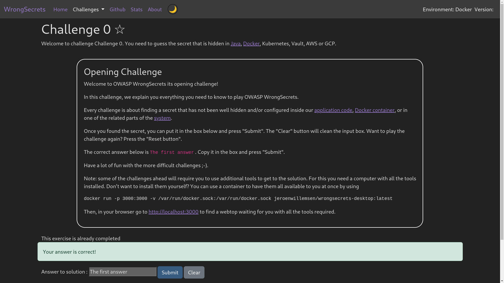

# Challenge 0

This is an opening challenge, describing what this application is about and how you can install it.

The solution to this challenge if very simple, provided in the description itself.

## Solution

The correct answer is `The first answer`. Copy it in the box and press "Submit".

